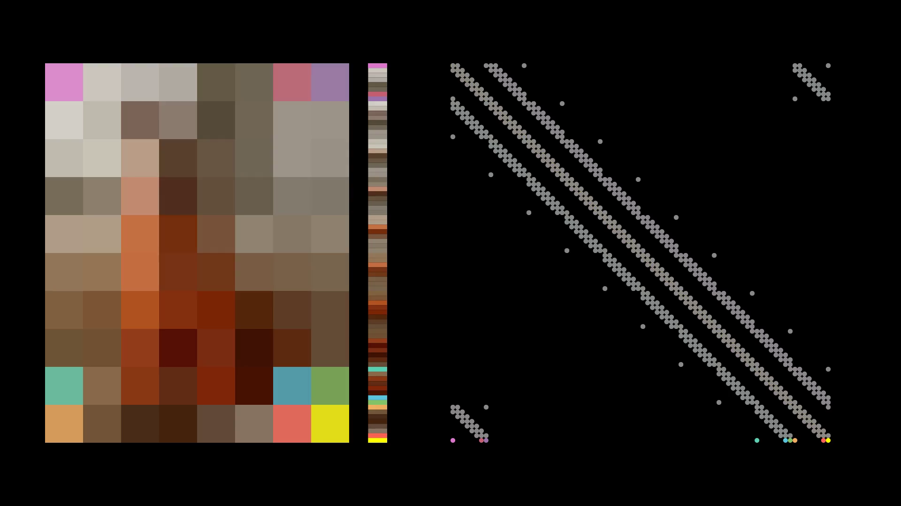

# GroupCDL
Code for the paper, [*GroupCDL: Interpretable Denoising and Compressed Sensing
MRI via Learned Group-Sparsity and Circulant
Attention*](https://ieeexplore.ieee.org/document/10874214), in IEEE
Transactions on Computational Imaging 2025 [(preprint
available)](https://arxiv.org/abs/2407.18967), which makes use of
[CirculantAttention.jl](https://github.com/nikopj/CirculantAttention.jl).

This repo additionally implements,
- [*CDLNet: Noise-Adaptive Convolutional Dictionary Learning Network for Blind Denoising and Demosaicing*](https://ieeexplore.ieee.org/document/9769957/), in IEEE OJSP 2022, [(code)](https://github.com/nikopj/CDLNet-OJSP).
- [*Gabor is Enough: Interpretable Deep Denoising with a Gabor Synthesis Dictionary Prior*](https://ieeexplore.ieee.org/document/9816313), in IEEE IVMSP 2022, [(preprint available)](https://arxiv.org/abs/2204.11146), [(code)](https://github.com/nikopj/CDLNet-OJSP).

<details>
<summary><h2>Install</h2><hr/></summary>
This repo uses Julia 1.10.

1. If you're on an HPC, set your julia depot path to somewhere you can install files, e.g. scratch.
Throw this in your `.bashrc` and source it
```bash
export JULIA_DEPOT_PATH="/scratch/$USER/.julia" 
export JULIAUP_DEPOT_PATH="/scratch/$USER/.julia" 
```

2. Install via [juliaup](https://github.com/JuliaLang/juliaup) manager:
```bash
curl -fsSL https://install.julialang.org | sh
```

3. Install project environment
In the GroupCDL directory, start a julia instance and instantiate the project environment,
```bash
julia --project -t auto
julia> using Pkg; Pkg.instantiate()
```

4. Multi-GPU (once project environment instantiated)
```bash
julia --project -t auto -e "import MPI; MPI.install_mpiexecjl()"
```
</details>

## Usage
The following asssumes you have a Julia REPL for the project open, e.g. `julia +1.10 --project`. All network and training details are given through a config file. Example config files can be seen in `trained_nets`. Config files are stitched together from `config` automatically in the first training example below. 

### Train your own model
Edit the configuration files in `configs/` to choose a network architecture, training, logging, and dataset details.
Then, in the Julia REPL, run,
```julia
julia> net, ps, st, ot = main(; network_config="config/groupcdl.yaml", closure_config="config/synthawgn_closure.yaml", data_config="config/image_data.yaml", warmup=true, train=true, verbose=true)
```

To train with multiple GPUs, we use MPI and call our main script as follows,
```bash
mpiexecjl -n <num_gpus> --project=. julia --project -t <num_cpus> main.jl --seed <seed> --train --warmup --verbose --mpi --config <path/to/config.yaml>"
 ```

Run `julia --project main.jl --help` for additional details on training from the commandline.

### Eval pretrained models
```julia
julia> net, ps, st, ot = main(; config="trained_nets/GroupCDL-S25/config.yaml", eval=true, verbose=true)
```

Optionally, you can provide alternate config files for the data and closure, ex., 
```julia
julia> net, ps, st, ot = main(; config="path/to/pretained_model/config.yaml", eval=true, eval_closure_config="config/synthawgn_closure.yaml", eval_data_config="config/image_data.yaml", verbose=true)
```
Note that the path to the checkpoint is specified in the config file.

## Extra
See `media/sliding_window.mp4` for an animation of how the block-circulant with circulant blocks sparsity pattern
of GroupCDL's adjacency matrix is a result of the sliding-window nonlocal self-similarity.


## Publications

If you find this code/work useful, please cite us:
```
@ARTICLE{janjusevicGroupCDL2025,
  author={Janjušević, Nikola and Khalilian-Gourtani, Amirhossein and Flinker, Adeen and Feng, Li and Wang, Yao},
  journal={IEEE Transactions on Computational Imaging}, 
  title={GroupCDL: Interpretable Denoising and Compressed Sensing MRI via Learned Group-Sparsity and Circulant Attention}, 
  year={2025},
  volume={11},
  number={},
  pages={201-212},
  doi={10.1109/TCI.2025.3539021}
}
```
```
@article{janjusevicCDLNet2022,
author={Janjušević, Nikola and Khalilian-Gourtani, Amirhossein and Wang, Yao},
journal={IEEE Open Journal of Signal Processing}, 
title={{CDLNet}: Noise-Adaptive Convolutional Dictionary Learning Network for Blind Denoising and Demosaicing}, 
year={2022},
volume={3},
number={},
pages={196-211},
doi={10.1109/OJSP.2022.3172842}
}
```
```
@INPROCEEDINGS{janjusevicGDLNet2022,
author={Janjušević, Nikola and Khalilian-Gourtani, Amirhossein and Wang, Yao},
booktitle={2022 IEEE 14th Image, Video, and Multidimensional Signal Processing Workshop (IVMSP)}, 
title={Gabor is Enough: Interpretable Deep Denoising with a Gabor Synthesis Dictionary Prior}, 
year={2022},
volume={},
number={},
pages={1-5},
doi={10.1109/IVMSP54334.2022.9816313}
}
```
